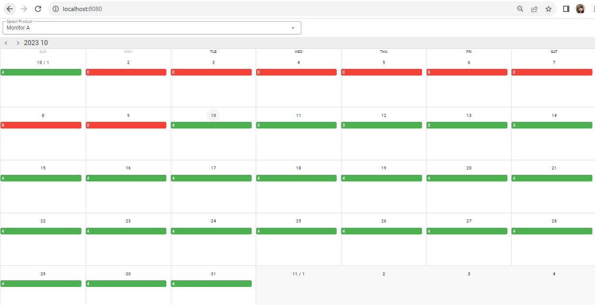

# Rent-Product-UI

## Description

Rent-Product-UI is a Vue.js project that displays the availability of stock items for each day over a month.

## Prerequisites

Before you begin, ensure you have the following prerequisites installed and set up:

- **Node.js**: [Installation instructions](https://nodejs.org/)
- **npm (Node Package Manager)**: It comes bundled with Node.js.
- **Vue.js**: [Installation instructions](https://vuejs.org/guide/quick-start.html)

## Installation

Follow these steps to set up Rent-Product-UI:

- Clone the repository:
- Navigate to the project directory
   ```bash
   cd rent-product-ui
- Install project dependencies
    ```bash
   npm install
- Start the development server
     ```bash
   npm run serve
- Visit localhost:8080 in your web browser to access the Rent-Product-UI application.

